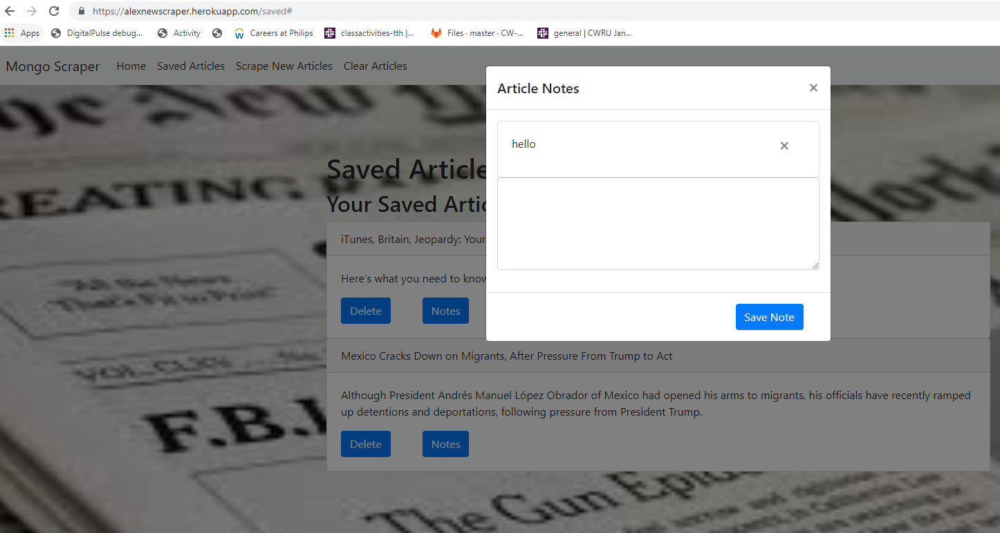

# News

# Description

A website was created that scrapes 10 articles from NY Times web site. A user has an option to save any amount of articles, delete all articles, scrape them again, delete a saved article, and make/delete notes on saved articles.

The home page has home, save article, scrape articles, and clear articles buttons in header. It also has "Mongo Scraper NY Times Edition" heading.

When user opens the home page, there is initially an empty page (displayed below).

When user clicks on scrape articles button, 10 articles from NY Times website world section are scraped and displayed in home page. If they were scraped before, duplicate articles are not scraped. Every article has article heading heading, summary, save article button, and link to article button (screenshot is below). If article link button is clicked, article is opened in NY Times web site.

If save article button is clicked near an article, that article is removed from home page and inserted into initially empty saved article page. The user can nagivate to saved article page by clicking on saved articles link (screenshot is below). The saved article page has similar links to the home page. Every saved article has delete and notes button next to it. Multiple articles can be saved.

If a user clicks on notes button on saved article, an initialy empty pop-up modal window is opened with option to enter and save note. If a user enters a note and saves it, the pop-up window is closed. If it is opened again, the note is present with an option to delete. Additional notes can be added.

If a user clicks on clear articles button, all articles and associated notes are deleted from the web site.

# Creation Process

# Front End

Handlebars and html file were used to created web pages. They were styled using bootstrap to be mobile responsive. Javascript and jQueris were used for back end of front end as well.

# Back End

Mongodb and mongoose were used for database. Node and express were used to run the website on Heroku. API routes were created using axios. Cheerio npm package was used to scrape NY Times web site.

